# LKW Instrumentation Journey — Meeting Diagrams
**Project:** Failure Injection and Propagation Analysis in Agentic Microservice Workflows  
**Author:** Deepak Sunil Chavan, Concordia University  
**Date:** 2026-07-16  
**Purpose:** Visual companion to the professor meeting script — covers everything from LKW flag design to policy-based recovery.  
**Companion file:** `PROFESSOR_MEETING_SCRIPT.md` (script), `diagrams_report.md` (architecture + cross-agent chains)

> All Mermaid diagrams render natively on GitHub. Numeric values sourced directly from JSON result files in this folder.

---

## Table of Contents

| # | Diagram | Covers Script Chapter |
|---|---|---|
| 1 | [LKW Checkpoint Flag Schema](#1-lkw-checkpoint-flag-schema) | Chapter 1 — What a flag is |
| 2 | [Flag Placement in the LangGraph Node Pipeline](#2-flag-placement-in-the-langgraph-node-pipeline) | Chapter 2 — How flags were inserted |
| 3 | [All 7 Agents — Checkpoint Chains](#3-all-7-agents--checkpoint-chains) | Chapter 2 — Per-agent chains |
| 4 | [RIP Computation Pipeline](#4-rip-computation-pipeline) | Chapter 3 — What RIP computes |
| 5 | [Stability Matrix — 64 Mode-Runs, 0 UNSTABLE](#5-stability-matrix--64-mode-runs-0-unstable) | Chapter 4 — Reproducibility proof |
| 6 | [HITL Tier: What the Flags Tell You](#6-hitl-tier-what-the-flags-tell-you) | Chapter 5 — HITL classification |
| 7 | [BOUNDARY_CHECK — New Checkpoint Type](#7-boundarycheck--new-checkpoint-type) | Chapter 7 — Boundary extension |
| 8 | [RECOVERY_ACTION — Full LKW Trace With Recovery](#8-recovery_action--full-lkw-trace-with-recovery) | Chapter 8 — Recovery in the trace |
| 9 | [End-to-End Journey: LKW Flag → Recovery](#9-end-to-end-journey-lkw-flag--recovery) | All chapters — summary |

---

## 1. LKW Checkpoint Flag Schema

**What a single LKW checkpoint record looks like — the unit of measurement.**

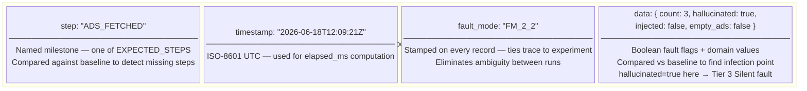

**Three purposes of the boolean flags in `data`:**

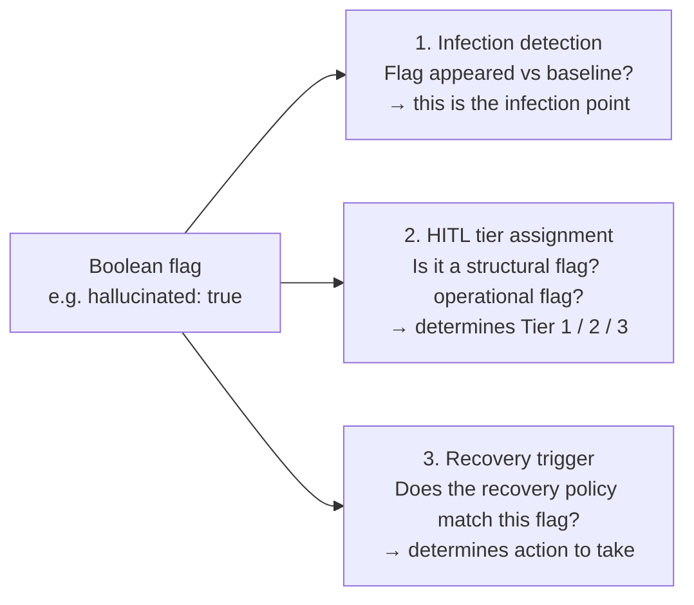

---

## 2. Flag Placement in the LangGraph Node Pipeline

**How `record_checkpoint()` calls are positioned relative to fault functions in the actual graph nodes.**  
Example: AdServiceAgent (`src/adserviceagent/app/graph.py`)

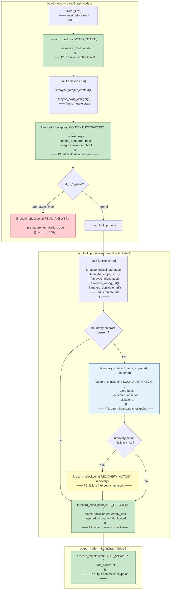

**Checkpoint placement classes (P1–P5):**

| Class | Name | When it fires | Example |
|---|---|---|---|
| P1 | Task Entry | First line of `input_node`, after `clear_lkw()` | `TASK_START` |
| P2 | Domain Decision | After fault functions, before returning state | `CONTEXT_EXTRACTED`, `ADS_FETCHED`, `CONVERT_DONE` |
| P3 | Output Commit | Final node, after building response | `FINAL_ANSWER` |
| P4 | Agent Boundary | When a handoff contract is evaluated | `BOUNDARY_CHECK` |
| P5 | Failure Intercept | When a recovery policy fires | `RECOVERY_ACTION` |

---

## 3. All 7 Agents — Checkpoint Chains

**The full `EXPECTED_STEPS` list for each agent — the baseline a healthy run must match.**

```mermaid
flowchart TD
  subgraph PA["PaymentAgent — 5 checkpoints"]
    direction LR
    p1[TASK_START] --> p2[CARD_VALIDATED] --> p3[CHARGE_DONE] --> p4[SAVE_DONE] --> p5[FINAL_ANSWER]
  end
  subgraph CA["CurrencyAgent — 3 checkpoints"]
    direction LR
    c1[TASK_START] --> c2[CONVERT_DONE] --> c3[FINAL_ANSWER]
  end
  subgraph EA["EmailServiceAgent — 4 checkpoints"]
    direction LR
    e1[TASK_START] --> e2[EMAIL_GENERATED] --> e3[EMAIL_SENT] --> e4[FINAL_ANSWER]
  end
  subgraph PC["ProductCatalogAgent — 3 checkpoints"]
    direction LR
    pc1[TASK_START] --> pc2[CATALOG_DONE] --> pc3[FINAL_ANSWER]
  end
  subgraph RA["RecommendationAgent — 3 checkpoints"]
    direction LR
    r1[TASK_START] --> r2[RECOMMEND_DONE] --> r3[FINAL_ANSWER]
  end
  subgraph AA["AdServiceAgent — 4 checkpoints"]
    direction LR
    a1[TASK_START] --> a2[CONTEXT_EXTRACTED] --> a3[ADS_FETCHED] --> a4[FINAL_ANSWER]
  end
  subgraph SS["ShippingService — 7 checkpoints (real LLM)"]
    direction LR
    s1[TASK_START] --> s2[QUOTE_DONE] --> s3[CARRIER_DONE] --> s4[TRACKING_DONE] --> s5[ESCALATION_CHECK] --> s6[FINAL_ANSWER] --> s7[SAVE_DONE]
  end

  style s1 fill:#fbe9e7,stroke:#e64a19
  style s2 fill:#fbe9e7,stroke:#e64a19
  style s3 fill:#fbe9e7,stroke:#e64a19
  style s4 fill:#fbe9e7,stroke:#e64a19
  style s5 fill:#fbe9e7,stroke:#e64a19
  style s6 fill:#fbe9e7,stroke:#e64a19
  style s7 fill:#fbe9e7,stroke:#e64a19
```

> ShippingService (orange) is the only agent that runs a live LLM — qwen2.5-coder:14b on SPEED HPC A100.  
> All other agents are deterministic Python (no LLM in loop) — used to validate the instrumentation framework.

---

## 4. RIP Computation Pipeline

**How the three RIP metrics are derived from the raw LKW trace list.**

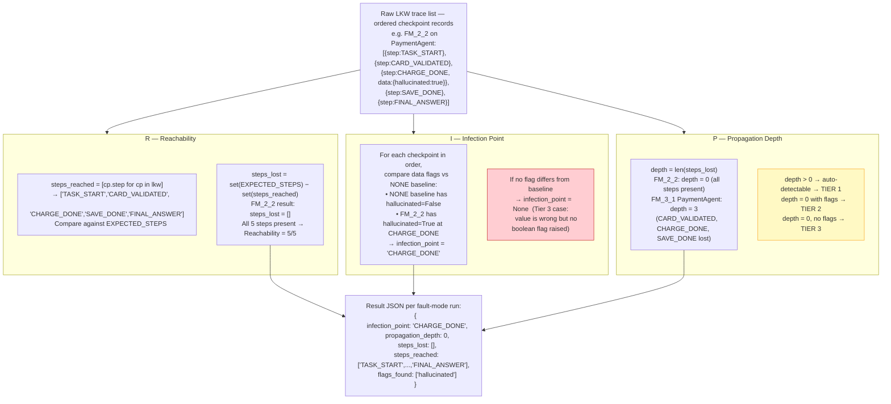

---

## 5. Stability Matrix — 64 Mode-Runs, 0 UNSTABLE

**Each cell = one fault mode run three independent times. Color = stability label.**  
**Data source:** `results/stability_summary.json` — SPEED HPC job 970059

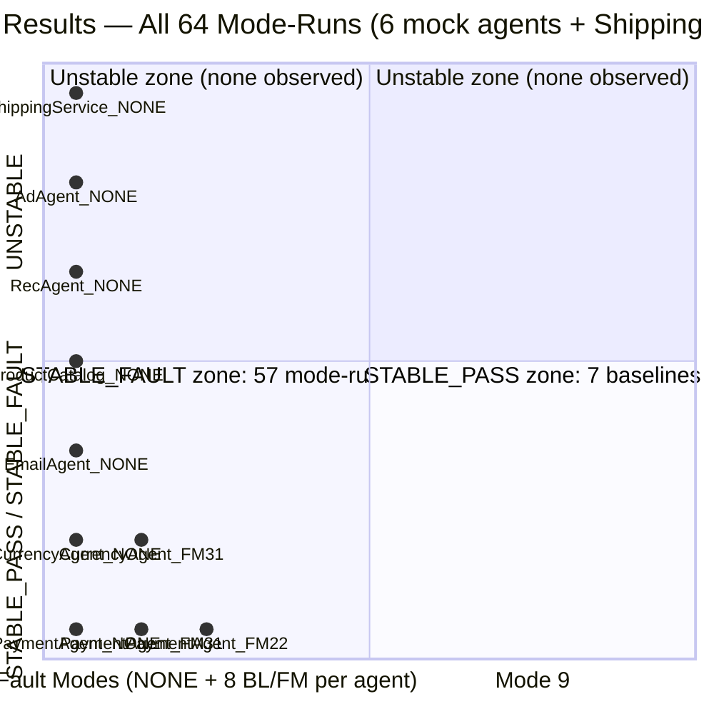

**Stability table (exact numbers):**

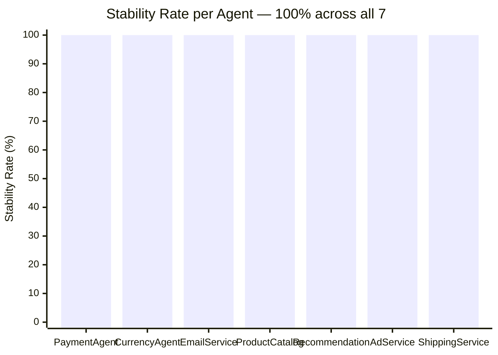

| Agent | Modes run | STABLE_PASS | STABLE_FAULT | UNSTABLE | Rate |
|---|---|---|---|---|---|
| PaymentAgent | 9 | 1 | 8 | 0 | **100%** |
| CurrencyAgent | 9 | 1 | 8 | 0 | **100%** |
| EmailServiceAgent | 9 | 1 | 8 | 0 | **100%** |
| ProductCatalogAgent | 9 | 1 | 8 | 0 | **100%** |
| RecommendationAgent | 9 | 1 | 8 | 0 | **100%** |
| AdServiceAgent | 9 | 1 | 8 | 0 | **100%** |
| ShippingService | 10 | 1 | 9 | 0 | **100%** |
| **TOTAL** | **64** | **7** | **57** | **0** | **100%** |

> Each mode-run = 3 independent executions. `STABLE_FAULT` means the LKW fingerprint was **identical** across all 3 runs — same infection_point, same steps_lost, same depth. Zero non-determinism observed.

---

## 6. HITL Tier: What the Flags Tell You

**How the boolean flags in the LKW data map to the three HITL tiers — and what action each tier requires.**

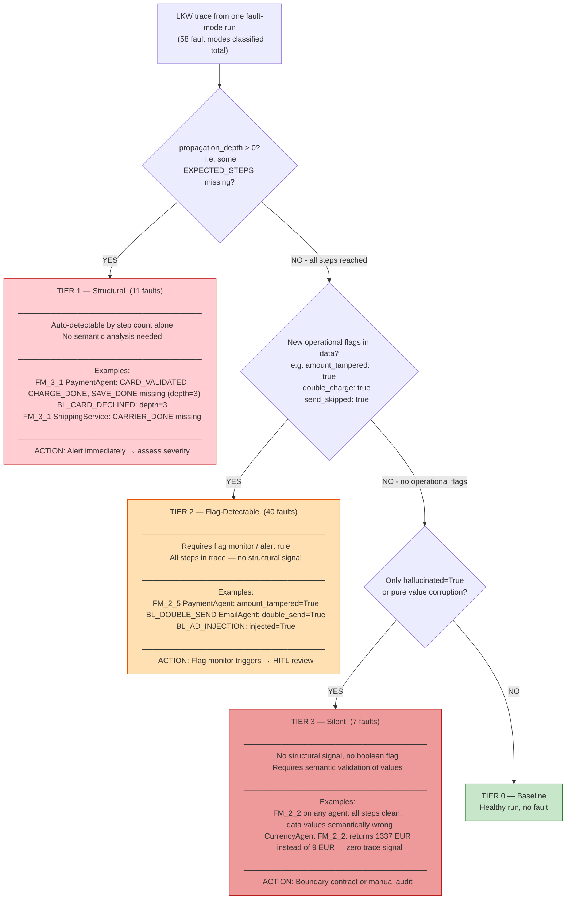

---

## 7. BOUNDARY_CHECK — New Checkpoint Type

**How `BOUNDARY_CHECK` was added to the LKW trace to catch silent Tier-3 hallucinations at agent handoffs.**

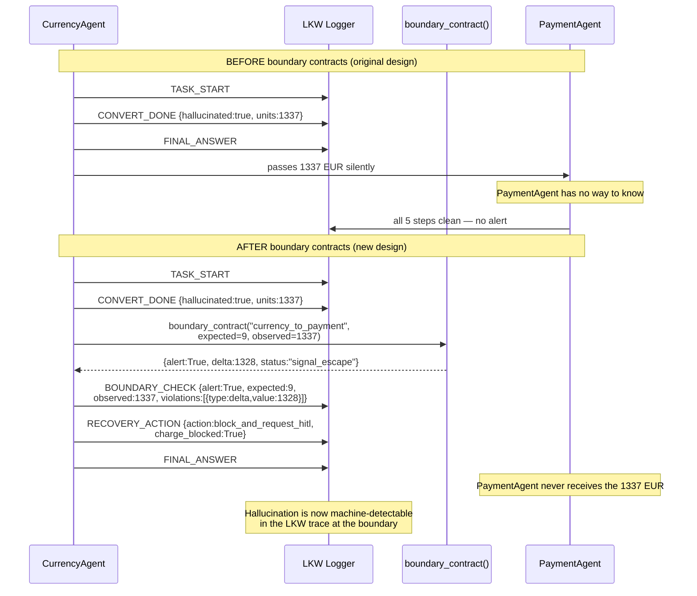

**Five boundary contracts implemented — from `boundary_detection_summary.json`:**

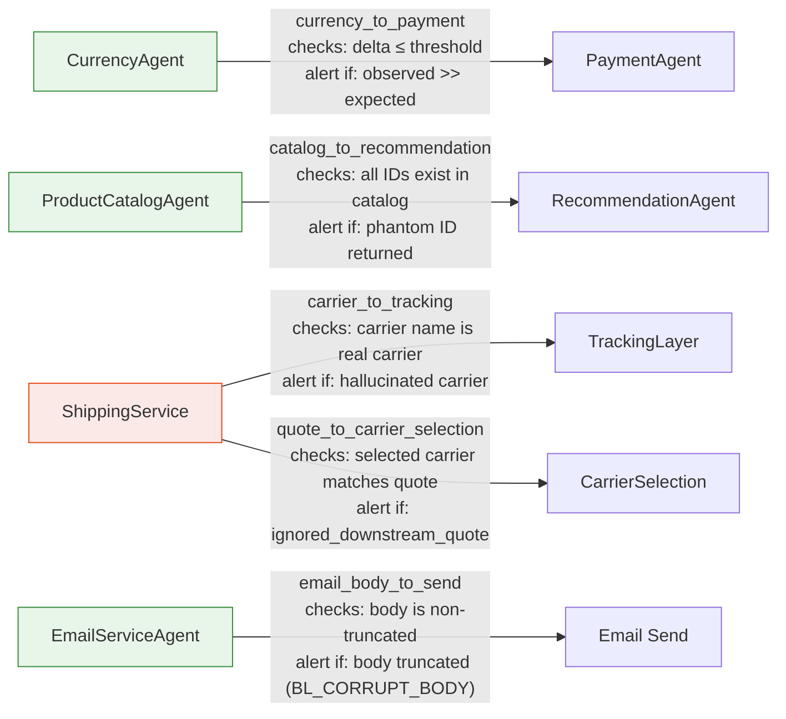

> Live evidence: `results/boundary_events.jsonl` — 13 events, 8 alerts, 5 clean.  
> Live dashboard: `src/boundary_dashboard.py` at `http://127.0.0.1:8765`

---

## 8. RECOVERY_ACTION — Full LKW Trace With Recovery

**The complete LKW trace evolution: from baseline → fault (no detection) → with boundary → with recovery.**

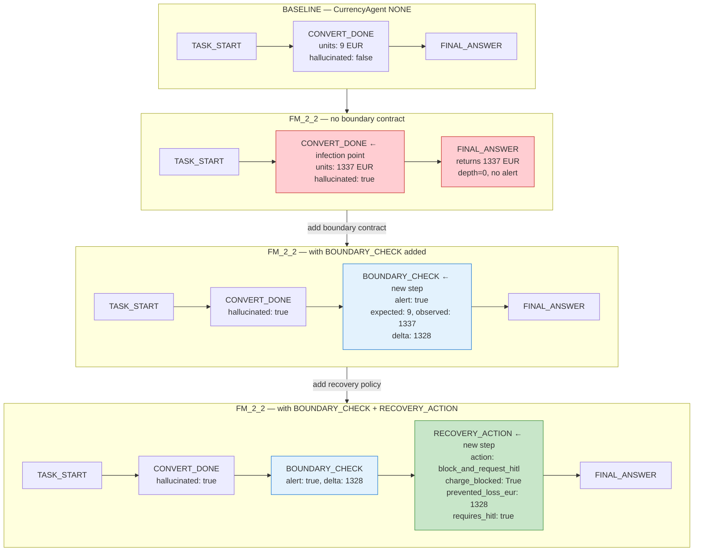

**Recovery wiring test results — from `test_recovery_wiring.py`:**

| Agent | Scenario | LKW Check | Result |
|---|---|---|---|
| CurrencyAgent | FM_2_2 → delta=1328 | `RECOVERY_ACTION` in lkw_steps | ✅ PASS |
| CurrencyAgent | FM_2_2 → delta=1328 | `FINAL_ANSWER` in lkw_steps | ✅ PASS |
| CurrencyAgent | FM_2_2 → delta=1328 | `CONVERT_DONE` NOT in lkw_steps (blocked) | ✅ PASS |
| ProductCatalogAgent | phantom ID | `RECOVERY_ACTION` in lkw_steps | ✅ PASS |
| ProductCatalogAgent | phantom ID | recovered_ids == ['PROD-001'] | ✅ PASS |
| AdServiceAgent | BL_AD_INJECTION | `RECOVERY_ACTION` in lkw_steps | ✅ PASS |
| EmailServiceAgent | BL_CORRUPT_BODY | boundary_blocked=True | ✅ PASS |
| **Total** | | | **19/19 PASS** |

---

## 9. End-to-End Journey: LKW Flag → Recovery

**The complete timeline of what was built, in order, from first checkpoint to final recovery test.**

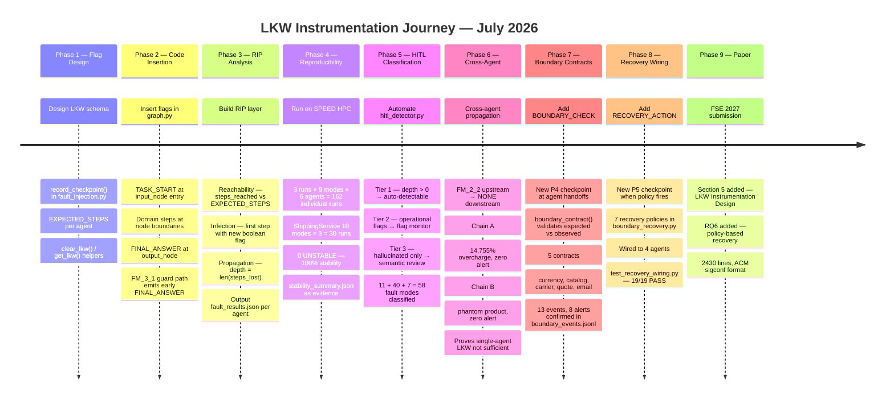

---

## Summary: What Each Checkpoint Type Measures

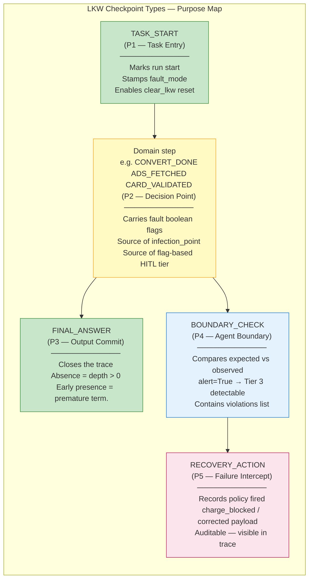

---

## How to Use This File

**GitHub:** All Mermaid diagrams render natively — share the file link directly with Professor.

**Slides:** Copy any diagram's Mermaid code into [mermaid.live](https://mermaid.live) → export PNG → paste into slides.

**Paper (LaTeX):** TikZ equivalents of the cross-agent chains and HITL tier tree are in `paper_updated.tex` Sections 11 and 9. This file supplements with the instrumentation-level detail not in the paper.
