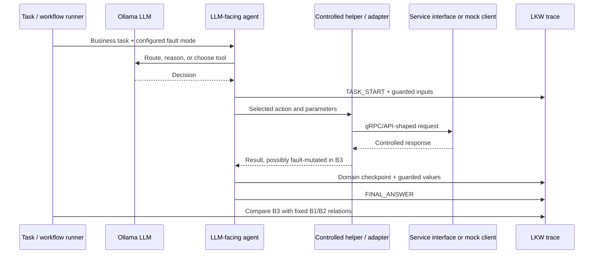
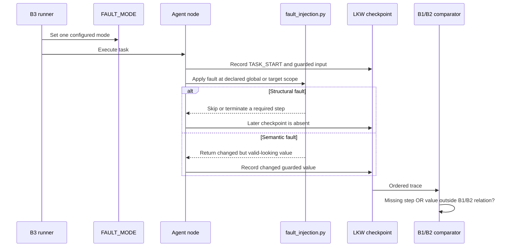
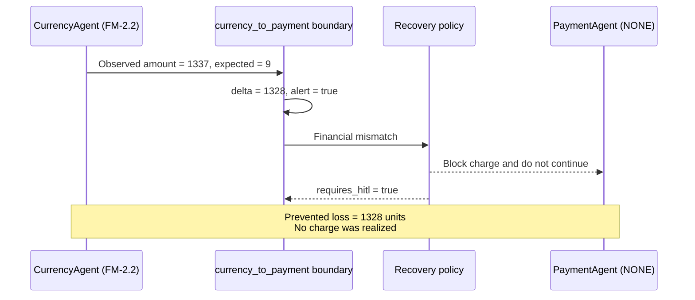
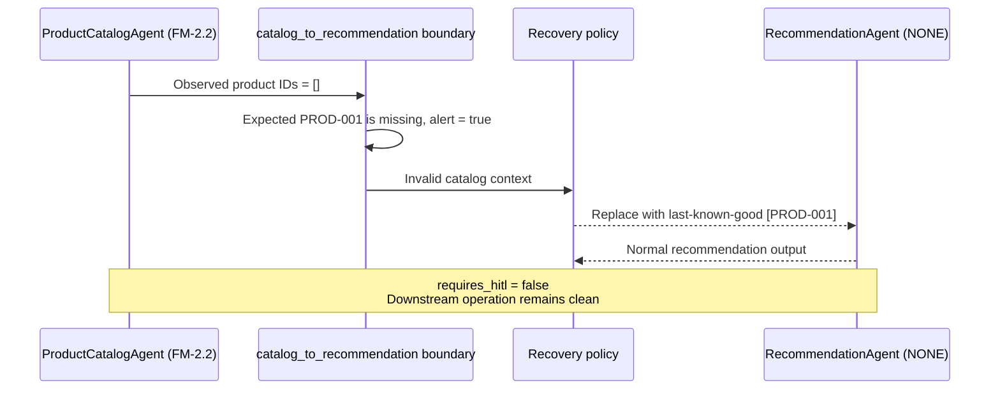
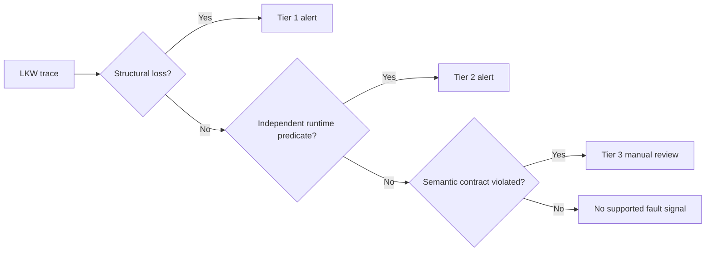
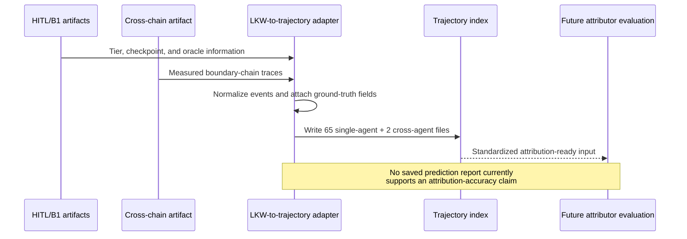

# LLM-MAS Results and Evidence Report

| Document metadata | Value |
|---|---|
| Version | August 2026 |
| Study | Data-Flow Fault Observation for Agentic Microservices |
| Benchmarks | Google Online Boutique (GB) and RetailBen shipping (RB) |
| Execution platform | Concordia SPEED HPC with Ollama |
| Associated manuscript | `src/results/paper_updated.pdf` |

---

## 1. Executive Summary

The study asks a simple question: when an LLM-facing agent calls a service, can a
wrong business value pass through a workflow even though every call appears to
succeed?

The answer from the current evidence is yes. Step completion alone is not enough.
Named LKW checkpoints must also record important values such as amount, currency,
product ID, recipient, carrier, quote, and tracking state.

The primary complete result is the targeted B3 matrix:

| Measure | Verified result |
|---|---:|
| Configurations | `qwen2.5:3b`, temperature 0.7 and 1.0 |
| Fault types | 10 |
| Repetitions per fault/configuration | 3 |
| Total B3 runs | 60 |
| Conclusive runs | 58 |
| Detected runs | 51 |
| False negatives | 7 |
| Inconclusive runs | 2 |
| Detection among conclusive runs | **51/58 = 87.9%** |
| Wilson 95% confidence interval | **[77.1%, 94.0%]** |

Two targeted cross-agent chains then tested handoff boundaries:

- **Currency to Payment:** 9 units became 1337 units. The boundary detected a
  difference of 1328 units, blocked the charge, and requested human review.
- **Catalog to Recommendation:** the expected product ID disappeared. The boundary
  restored the last-known-good product context and continued without human review.

These are containment demonstrations for two predefined policies. They are not a
general recovery-rate estimate.

---

## 2. Experimental Scope and Evidence Boundaries

The results are derived from saved execution traces and use explicit denominators.
The following scope boundaries define what those results support:

- The systematic B2 and B3 executions invoked actual `qwen2.5-coder:14b` or
   `qwen2.5:3b` models through the Ollama server. These were live model inferences,
   not prerecorded or manually supplied LLM responses.
- The checkout inputs were controlled synthetic benchmark fixtures, including fixed
   products, address, card, currency, and package values. They were not customer or
   production data.
- Service responses in the systematic runners were controlled mocks or stubs that
   preserve the expected gRPC/API response shapes. Therefore, the evidence measures
   agent reasoning and fault observability at controlled service interfaces; it does
   not establish that every request reached a separately deployed microservice.
- B1 combines cached deterministic `NONE`-mode traces for six service agents with a
   selected live-LLM `qwen2.5-coder:14b`, temperature 0 shipping baseline. B1 should
   not be described as live LLM inference for every agent.
- The complete pooled B3 estimate uses only `3b_temp0.7` and `3b_temp1.0`.
  Earlier or lower-temperature campaigns are separate evidence.
- Later deviations under globally injected FM faults are descriptive. They are not
  proof that the first agent caused every later deviation.
- The HITL artifact classifies review needs; it does not implement an automated
  verifier agent.
- AgentTracer-compatible files have been produced, but no saved prediction report
  establishes attribution accuracy.

### Execution method by phase

| Phase | LLM execution | Inputs and service behavior | Role in the study |
|---|---|---|---|
| B1 | Deterministic no-fault traces for six service agents; live `qwen2.5-coder:14b` at temperature 0 for shipping | Controlled benchmark fixtures and service-shaped deterministic responses | Establish expected checkpoints and guarded values |
| B2 isolated | Deterministic no-fault agent runs | Controlled benchmark fixtures | Characterize stable fields for isolated surfaces |
| B2 systematic | Live Ollama inference across the checkout orchestration and agent helpers | Controlled benchmark fixtures with mocked/stubbed service responses | Measure normal model-dependent trace variation |
| B3 | Live `qwen2.5:3b` Ollama inference at temperatures 0.7 and 1.0 | The same controlled fixtures and service interfaces, with one configured fault condition per run | Measure fault observability against fixed B1/B2 relations |

Accordingly, the accurate description is **live-LLM experiments over controlled
benchmark data and controlled service interfaces**. The saved JSON files are measured
execution evidence, but the input records are not production datasets.

---

## 3. System in One Diagram



The architecture separates three concerns:

1. **LLM reasoning:** routing, tool selection, and response generation can vary.
2. **Controlled service interaction:** helpers make experiments repeatable.
3. **Observation:** LKW checkpoints record values at definition, use, and boundary
   points.

---

## 4. Technology Used

| Layer | Technology | Purpose in this study |
|---|---|---|
| Agent graphs | Python, LangGraph | Route requests and execute agent nodes |
| Agent APIs | FastAPI | Expose GB agent endpoints |
| Service protocols | gRPC/protobuf-shaped clients | Preserve microservice request/response contracts |
| Checkout agent | Go | ReAct/tool orchestration surface and isolated evidence |
| Cart agent | C#/.NET with Python harness | Cart surface and isolated evidence |
| Shipping orchestration | Python ReAct loop | Quote, carrier, tracking, and save workflow |
| LLM runtime | Ollama | Local model inference on SPEED |
| Models explored | `qwen2.5-coder:14b`, `qwen2.5:3b` | B2/model exploration and B3 execution |
| Result storage | JSON | Raw traces, summaries, HITL tiers, and trajectories |
| Paper | ACM `acmart` LaTeX | Final research manuscript |

The final complete B3 comparison uses `qwen2.5:3b` at temperatures 0.7 and 1.0.
The B2 systematic runner also defines `qwen2.5-coder:14b` at temperature 0 and
`qwen2.5:3b` at temperatures 0, 0.7, and 1.0. Those configurations should not be
pooled unless they contain the same current fault matrix.

---

## 5. Agent and Service Implementation

### 5.1 Common GB agent pattern

Most Python GB agents follow this path:

```text
app/main.py -> app/router.py -> app/graph.py -> app/agent.py
                                      |             |
                                      +------ app/fault_injection.py
                                                    |
                                             service client/helper
```

- `main.py` creates the FastAPI application.
- `router.py` defines the HTTP endpoint and graph invocation.
- `graph.py` defines LangGraph state, LLM routing, and node order.
- `agent.py` performs the domain action and calls the service client.
- `fault_injection.py` reads the configured mode, mutates values/control flow, and
  records LKW checkpoints.
- `co_helper_*.py` gives B1/B2/B3 runners a controlled, repeatable entry point.

### 5.2 Per-agent map

| Agent/service surface | Main responsibility | Important implementation files | Main observed values |
|---|---|---|---|
| ProductCatalogAgent | List/search products and expose catalog values | `src/productcatalogagent/app/graph.py`, `agent.py`, `fault_injection.py`; service: `src/productcatalogservice/server.py`; helper: `src/co_helper_productcatalog.py` | action, product IDs, count, price flag |
| CurrencyAgent | Route and perform currency conversion | `src/currencyagent/app/graph.py`, `agent.py`, `fault_injection.py`; service: `src/currencyservice/server.js`; helper: `src/co_helper_currency.py` | input/output units, target currency, rate/tamper flags |
| PaymentAgent | Validate card, charge, and save transaction | `src/paymentagent/app/graph.py`, `agent.py`, `fault_injection.py`; service: `src/paymentservice/index.js`; helper: `src/co_helper_payment.py` | requested/charged amount, validation, transaction schema, save state |
| EmailServiceAgent | Generate and send confirmation email | `src/emailserviceagent/app/graph.py`, `agent.py`, `fault_injection.py`; service: `src/emailservice/email_server.py`; helper: `src/co_helper_email.py` | recipient, body length/type, send status |
| RecommendationAgent | Produce recommendations from user/product context | `src/recommendationagent/app/graph.py`, `agent.py`, `fault_injection.py`; service: `src/recommendationservice/recommendation_server.py`; helper: `src/co_helper_recommendation.py` | context IDs, recommendation IDs/count |
| AdServiceAgent | Select ads from context keys | `src/adserviceagent/app/graph.py`, `agent.py`, `fault_injection.py`; service: `src/adservice/src/main/java/hipstershop/AdService.java`; helper: `src/co_helper_adservice.py` | context keys, ad count, IDs/URLs |
| CartAgent | Manage cart item/quantity state | `src/cart-agent/src/`, `src/cart-agent/test_fault_injection.py`; helper: `src/co_helper_cart.py` | user/product ID, quantity, item count |
| Checkout orchestrator | Coordinate checkout tools/services | `src/checkout-agent/agent/agent.go`, `tools/tools.go`, `test_fault_injection.py`; helper: `src/co_helper_checkout_orchestrator.py` | required workflow steps; no field-level B1 oracle |
| ShippingQuoteAgent | Build shipping quote from package and destination | `src/shippingagent/app/orchestrator.py`, `fault_injection.py`, `agents/`; helper: `src/co_helper_shipping.py` | item count, quote cost |
| ShipOrderAgent | Select carrier, create tracking, and save order | same shipping files plus `src/shippingagent/app/repository.py` | carrier, tracking ID, escalation, save state |

### 5.3 Coverage categories

These categories should not be mixed:

- **Complete B3 matrix:** ProductCatalogAgent, CurrencyAgent, PaymentAgent,
  EmailServiceAgent, ShippingQuoteAgent, and ShipOrderAgent.
- **Systematic structural role:** checkout orchestrator.
- **Isolated evidence:** RecommendationAgent, AdServiceAgent, and CartAgent.
- **Cross-chain sinks:** PaymentAgent and RecommendationAgent.

---

## 6. How LKW and Fault Injection Are Wired

An LKW record contains a named step and a data object. The enclosing trace identifies
the agent. Typical fields are:

```json
{
  "step": "CHARGE_DONE",
  "timestamp": "...",
  "data": {
    "units_charged": 1337,
    "hallucinated": true
  }
}
```

The test harness also knows the configured fault mode. This is ground-truth metadata,
not detection evidence by itself.



### Fault families

| Fault | Meaning | Typical LKW evidence |
|---|---|---|
| FM-3.1 | Premature termination | Missing required checkpoints |
| FM-1.2 | Wrong action or route | Wrong branch, carrier, currency, or recipient |
| FM-2.2 | Hallucinated output | Fabricated value at a checkpoint or handoff |
| FM-2.5 | Input ignored or replaced | Guarded input changes at use/output |
| BL-* | Domain-specific corruption | Wrong price, rate, amount, body, quote, or tracking state |

### What counts as detection

A B3 run is detected when either condition holds:

1. A checkpoint required by B1 is absent.
2. A guarded value violates its predeclared B1/B2 relation.

Diagnostic flags such as `amount_tampered`, `hallucinated`, or `save_skipped` explain
the controlled experiment. They are useful ground truth, but production monitoring
would need independent predicates that infer the same condition from real values.

---

## 7. B1, B2, and B3

### 7.1 B1: expected checkpoint state

**Runner:** `src/b1_oracle_runner.py`
**Main artifacts:** `src/results/b1_oracle_values.json`,
`src/results/checkpoint_variable_map.json`

B1 uses controlled `NONE`-mode executions to establish expected steps and guarded
values. Six service agents use deterministic helpers. Shipping uses a selected
no-fault systematic baseline. The checkout orchestrator has an expected step sequence
but no field-level oracle.

B1 answers: **What should be present, and what should the important values mean?**

Volatile identifiers are not treated as fixed strings. For example, a transaction ID
is compared by schema/format while an amount can use exact or tolerance comparison.

### 7.2 B2: no-fault characterization

**Runners:** `src/b2_variance_runner.py`, `src/b2_systematic_runner.py`
**Artifacts:** `src/results/b2_variance_report.json`,
`src/results/b2_equivalence_thresholds.json`, `src/results/b2_systematic/`

B2 repeats no-fault execution to identify which fields are stable and which fields are
legitimately variable. The isolated report contains three repetitions for seven
surfaces. A separate systematic runner exercises the live-LLM workflow and multiple
model configurations.

B2 answers: **How much difference is normal when no fault is active?**

The main finding is methodological: exact trace identity is unsafe because generated
IDs and some LLM outputs vary. Numeric, categorical, set, schema, and boolean relations
must be selected per guarded field before B3 is judged.

### 7.3 B3: one configured fault per run

**Runner:** `src/b3_runner.py`
**Artifacts:** `src/results/b3/`, `src/results/coverage_matrix.json`

The complete matrix is:

```text
10 faults x 2 model configurations x 3 repetitions = 60 runs
```

| Configuration | TP | Partial TP | FN | Inconclusive | Detection among conclusive |
|---|---:|---:|---:|---:|---:|
| 3b, temperature 0.7 | 12 | 16 | 2 | 0 | 28/30 = 93.3% |
| 3b, temperature 1.0 | 11 | 12 | 5 | 2 | 23/28 = 82.1% |
| **Total** | **23** | **28** | **7** | **2** | **51/58 = 87.9%** |

`TP` means at least two compared agents deviated. `Partial TP` means exactly one
compared agent deviated. Both are detected runs.

The lower observed rate at temperature 1.0 shows that model configuration affects
observability. The weakest fault was corrupted email body: 1 detection among 5
conclusive runs, with 1 additional inconclusive run.

---

## 8. How the Results Are Calculated

For a configuration:

```text
detected = TP + Partial TP
conclusive = TP + Partial TP + FN
detection rate = detected / conclusive
inconclusive runs are reported separately
```

For the pooled matrix:

```text
detected = 23 + 28 = 51
conclusive = 23 + 28 + 7 = 58
detection rate = 51 / 58 = 0.879 = 87.9%
```

Wilson 95% confidence intervals are used because several denominators are small. The
interval describes uncertainty around the observed run-level proportion; it does not
prove performance on other systems.

RIP is reported separately:

- **Reachability:** the relevant step/boundary was executed.
- **Infection:** a required checkpoint or guarded value first differed.
- **Propagation:** the difference appeared at a later observation or boundary.

For globally injected FM modes, later deviations can be independent effects of the
same global injection. They are not automatically causal propagation from the first
agent.

---

## 9. Cross-Agent Chains

**Runner:** `src/cross_agent_propagation.py`
**Validation:** `src/boundary_validation.py`
**Recovery:** `src/boundary_recovery.py`
**Evidence:** `src/results/cross_agent_propagation.json`

### 9.1 Chain A: Currency to Payment



Observed outcome:

- The corrupted value reached the payment boundary.
- A range/consistency contract exposed the mismatch.
- The policy blocked the operation and requested HITL.
- The 1328-unit value is prevented loss, not realized loss.

### 9.2 Chain B: Product Catalog to Recommendation



Observed outcome:

- The invalid product context reached the recommendation boundary.
- The policy restored validated context.
- The downstream agent completed without HITL.

Across both chains, 2/2 boundary policies executed and 1/2 avoided HITL. With only two
chains, this is feasibility evidence rather than a general success rate.

---

## 10. HITL Evidence

**Classifier:** `src/hitl_detector.py`
**Artifact:** `src/results/hitl_classification_report.json`

The saved artifact contains 48 injected isolated-agent cases and excludes six `NONE`
baselines.

| Tier | Cases | Meaning | Current interpretation |
|---|---:|---|---|
| Tier 1: structural | 8 (16.7%) | Missing steps or structural depth difference | Automatically detectable from trace shape, but still marked as requiring HITL |
| Tier 2: flag-detectable | 34 (70.8%) | Harness diagnostic field identifies corruption | Needs an equivalent runtime predicate before production automation |
| Tier 3: silent semantic | 6 (12.5%) | Values are wrong without a structural signal | Requires semantic validation against B1/B2-style contracts |

All 48 injected cases are marked `hitl_required=true` in the saved classification.
Only the eight Tier 1 cases are marked automatically detectable. Automatic detection
must not be described as automatic resolution.

The current workflow is:



There is no automated verifier agent yet. Final HITL decisions still depend on manual
trace inspection. A verifier agent is a next-stage research component.

---

## 11. AgentTracer-Compatible Conversion

**Adapter:** `src/agentracer_adapter/lkw_to_trajectory.py`
**Pipeline:** `src/agentracer_adapter/run_attribution_pipeline.py`
**Attributors/evaluation code:** `attributor.py`, `evaluate_attribution.py`
**Index:** `src/results/agentracer/trajectories_index.json`

The adapter produced 67 trajectory files:

- 65 reconstructed single-agent trajectories.
- 2 converted cross-agent trajectories.



The single-agent files are reconstructions derived from HITL classifications and B1
values, with synthetic deviation markers at known infection steps. They are not 65 new
fault executions. Ground-truth agent/step fields can be null for baselines or
unlocalized cases.

Current conclusion: **the conversion pipeline is ready for attribution experiments,
but attribution accuracy remains unanswered.**

---

## 12. Overall Findings

1. **Successful completion does not imply correct business data.** Semantic faults can
   preserve all expected workflow steps.
2. **Value checkpoints add information that ordinary step monitoring misses.** Amount,
   product, recipient, quote, and tracking values must be validated where they cross
   boundaries.
3. **B1, B2, and B3 must remain separate.** B1 defines expected behavior, B2 defines
   acceptable no-fault variation, and B3 tests observability under a controlled fault.
4. **Detection depends on model configuration.** The complete matrix observed 93.3%
   detection at temperature 0.7 and 82.1% at temperature 1.0.
5. **Email content is the current weak point.** Corrupted body had the lowest
   fault-level detection rate.
6. **Global injection complicates causal propagation claims.** Later deviations are
   descriptive unless a targeted chain isolates the upstream source.
7. **Boundary policies can contain harm.** One chain blocked an unsafe financial
   action; the other restored validated context automatically.
8. **HITL is not yet automated.** Trace tiers identify where automation may be
   possible, but final judgments are still manual.
9. **AgentTracer conversion is infrastructure, not an attribution result.** The next
   experiment must run predictions and compare them with held-out ground truth.

---

## 13. Recommended Research and Development Steps

### Immediate development

1. Add production-style validators that infer Tier 2 conditions from real values
   instead of trusting injected diagnostic flags.
2. Add semantic contracts for Tier 3 fields, beginning with email body/recipient,
   payment amount, product IDs, and shipping quote consistency.
3. Preserve an `ATTRIBUTION_HINT` whenever a boundary blocks or repairs a payload so
   recovery does not erase the source evidence.
4. Automate HITL routing: auto-resolve only low-risk cases with explicit policy;
   escalate financial, ambiguous, or irreversible operations.
5. Re-run targeted chains without globally injecting the downstream agents, and add
   more than two chains before estimating a recovery rate.

### Next experiments

1. Run all services in a real deployed gRPC environment and compare results with the
   controlled-helper environment.
2. Increase repetitions per fault/configuration to narrow confidence intervals.
3. Add a held-out B2 calibration set and a separate B3 evaluation set.
4. Test larger and different model families while keeping the same fault matrix.
5. Evaluate latency, token, and storage overhead of checkpoint instrumentation.
6. Run the AgentTracer attribution pipeline on independent measured trajectories and
   report agent accuracy, step accuracy, and abstention behavior.

### Research-level direction

The next contribution should be a **Verifier Agent** that consumes LKW traces and
boundary contracts, checks whether a plan/output is valid, proposes a recovery action,
and explains when human approval is required. It should be evaluated separately from
the current annotation pipeline so detection, recovery, and attribution do not share
their own ground truth.

---

## 14. Evidence and Reproducibility Index

| Question | Controlling artifact |
|---|---|
| Which agents and evidence types are covered? | `src/results/coverage_matrix.json` |
| Which variables are guarded? | `src/results/checkpoint_variable_map.json` |
| What is the B1 oracle? | `src/results/b1_oracle_values.json` |
| What variation is accepted in B2? | `src/results/b2_equivalence_thresholds.json`, `src/results/b2_systematic/` |
| What happened in the complete B3 matrix? | `src/results/b3/`, paper Tables 12 and 13 |
| What happened across agent boundaries? | `src/results/cross_agent_propagation.json` |
| Which cases need HITL? | `src/results/hitl_classification_report.json` |
| How stable was the shipping fingerprint? | `src/results/stability_matrix_shippingagent.json` |
| What was converted for AgentTracer? | `src/results/agentracer/trajectories_index.json` |
| What claims are publication-ready? | `src/results/paper_updated.tex` and `paper_updated.pdf` |

---

## 15. Conclusion

The experiments show that agentic microservices need value-aware observation, not only
step or success monitoring. The complete B3 campaign detected 51 of 58 conclusive runs.
The cross-agent demonstrations show why handoff contracts matter: one unsafe amount was
blocked and one invalid product context was repaired. The remaining work is to replace
experiment-only flags with production predicates, automate carefully bounded HITL
routing, evaluate more targeted chains, and test AgentTracer attribution on independent
measured trajectories.