# LLM-MAS Fault Injection Study — Results Report

**Author:** Deepak Sunil Chavan, Concordia University  
**Platform:** Concordia SPEED HPC, speed-25 node (Tesla V100 GPU)  
**Branch:** `deepak/fault-injection`  
**Date:** July 2026 — real live-LLM runs (not mock data)

---

## 1. Evidence — What We Ran, Which Agents, and What We Got Back

We ran fault injection tests against **9 agents** using a real language model (Ollama on
SPEED HPC). Every number in this report comes from real LLM inference — the model was
actually running, making real tool calls, and returning real responses.

### The 9 Agents We Tested

| Agent | Language | Model(s) Used | Fault Modes Tested |
|-------|----------|--------------|-------------------|
| ProductCatalogAgent | Python | qwen2.5:3b, temp=0 | 8 |
| CartAgent | C# (via Python wrapper) | qwen2.5:3b, temp=0 | 10 |
| AdServiceAgent | Python | qwen2.5:3b, temp=0 | 14 |
| RecommendationAgent | Python | qwen2.5:3b, temp=0 | 14 |
| PaymentAgent | Python | qwen2.5:3b and qwen2.5-coder:14b, 4 configs | 56 (14 × 4) |
| CurrencyAgent | Python | qwen2.5:3b and qwen2.5-coder:14b, 4 configs | 56 (14 × 4) |
| EmailServiceAgent | Python | qwen2.5:3b and qwen2.5-coder:14b, 4 configs | 56 (14 × 4) |
| ShippingQuoteAgent | Python | qwen2.5:3b and qwen2.5-coder:14b, 4 configs | 40 (10 × 4) |
| ShipOrderAgent | Python | qwen2.5:3b and qwen2.5-coder:14b, 4 configs | 40 (10 × 4) |

Jobs ran on Concordia SPEED HPC (Slurm), jobs 1170215–1170223. Results written to
`src/results/per_agent_llm/per_agent_llm_report.json`.

### What Context Each Run Produced

Every run produced a JSON trace with the following information:
- Which LKW checkpoints the agent hit (e.g., TASK_START → CHARGE_DONE → FINAL_ANSWER)
- The data payload at each checkpoint (amounts, flags, product lists, email content, etc.)
- Whether the LLM called the expected tools or skipped them
- The final verdict: **KILLED**, **LIVE**, or **INCONCLUSIVE**

### Overall Numbers (258 real mutant tests)

| Outcome | Count | Percentage |
|---------|-------|-----------|
| Killed (fault detected) | 75 | 29.1% |
| Live (fault not detected) | 90 | 34.9% |
| Inconclusive (too noisy to decide) | 93 | 36.0% |
| **Total** | **258** | |

### Per-Agent Kill Rates

| Agent | Killed | Live | Inconc. | Kill Rate |
|-------|--------|------|---------|----------|
| ProductCatalog | 8 | 0 | 0 | **100.0%** |
| Cart | 10 | 0 | 0 | **100.0%** |
| AdService | 8 | 6 | 0 | **57.1%** |
| Recommendation | 8 | 6 | 0 | **57.1%** |
| Payment (all 4 configs) | 20 | 24 | 0 | **45.5%** |
| Currency (all 4 configs) | 15 | 29 | 0 | **34.1%** |
| Email (all 4 configs) | 6 | 5 | 33 | **13.6%** |
| ShippingQuote | 0 | 10 | 30 | **0.0%** |
| ShipOrder | 0 | 10 | 30 | **0.0%** |
| **Total** | **75** | **90** | **93** | **29.1%** |

---

## 2. B1 — The Oracle: What "Correct" Looks Like

**What it is:** Before injecting any faults, we first ran every agent in a completely
deterministic mode — no live LLM, no real network calls. This gave us the ground truth
of what each agent is supposed to do and what values it is supposed to produce.

**How we collected it:** We set `USE_LLM=false` and replaced each agent's gRPC
dependencies with controlled mocks that return fixed, known values. The agent ran through
its full workflow, and we recorded the exact values at every checkpoint.

What B1 captures for each agent:
- The exact sequence of steps that should execute (which checkpoints should be hit)
- The exact data value at each checkpoint (what amount, what product list, what recipient, etc.)
- All boolean flags in their "clean" state (False — nothing injected)

**Example — PaymentAgent B1 trace:**
```
TASK_START       input: {amount: 9.00, card: "4111..."}
CARD_VALIDATED   validated: True, amount: 9.00, amount_tampered: False
CHARGE_DONE      charged: 9.00, double_charge: False
SAVE_DONE        saved: True, save_skipped: False
FINAL_ANSWER     "Payment of 9.00 processed successfully"
```

This trace is the reference. In a B3 fault run, if `charged` is 9999 instead of 9.00,
or if `CHARGE_DONE` is missing entirely, the B3 analyser catches it by comparing
against this B1 baseline.

B1 is only run once per agent (deterministic — same result every time). It does not
report kill rates; it only sets the reference fingerprint.

---

## 3. B2 — Baseline Noise: How Much Does the LLM Vary on Its Own?

**What it is:** Before declaring that a fault run is "detected," we need to know how
much the live LLM naturally varies even when nothing is broken. B2 answers this by
running each agent with the real LLM, but with **no fault injected** (`FAULT_MODE=NONE`).

**How we ran it:** We ran each agent 3–10 times per model config with `FAULT_MODE=NONE`.
The runs went through the same Slurm jobs as B3, same Ollama server, same everything —
the only difference is the fault mode is off.

**How it is wired:** Each agent's `fault_injection.py` checks `os.environ["FAULT_MODE"]`
at every tool call. When it sees `NONE`, it returns the clean, unmodified data. The LLM
runs freely and produces its natural output. We log these runs exactly like B3 runs.

**What we looked for:** Does any B2 run trigger a kill verdict? If yes, that would be a
false positive — our checkpoints firing on normal LLM output. A false positive means our
detection threshold is too tight and we can't trust B3 kills.

**Results — B2 false positive rate across all 212 runs:**

| Agent | Config | Runs | False Positives | FP Rate |
|-------|--------|------|----------------|---------|
| ProductCatalog | 3b, t=0 | 3 | 0 | 0.0% |
| Cart | 3b, t=0 | 3 | 0 | 0.0% |
| AdService | 3b, t=0 | 3 | 0 | 0.0% |
| Recommendation | 3b, t=0 | 3 | 0 | 0.0% |
| Payment | 3b, t=0 | 10 | 0 | 0.0% |
| Payment | 14b, t=0 | 10 | 0 | 0.0% |
| Payment | 3b, t=0.7 | 10 | 0 | 0.0% |
| Payment | 3b, t=1.0 | 10 | 0 | 0.0% |
| Currency | 3b, t=0 | 10 | 0 | 0.0% |
| Currency | 14b, t=0 | 10 | 0 | 0.0% |
| Currency | 3b, t=0.7 | 10 | 0 | 0.0% |
| Currency | 3b, t=1.0 | 10 | 0 | 0.0% |
| Email | all 4 configs | 40 | 0 | 0.0% |
| ShippingQuote | all 4 configs | 40 | 0 | 0.0% *(7–10 gRPC errors, not FP)* |
| ShipOrder | all 4 configs | 40 | 0 | 0.0% *(7–10 gRPC errors, not FP)* |

**What this means:** Our checkpoints never fire on normal live-LLM output. Every kill
verdict in B3 is a genuine fault-induced deviation, not just random LLM noise.

Note on shipping gRPC errors: The CartService and ProductCatalogService were not
co-launched in the Slurm job, so shipping agents got connection errors. These are
infrastructure errors (logged separately), not false positives.

---

## 4. B3 — The Actual Fault Injection Runs

**What it is:** B3 is the real experiment. We turn on a specific fault, run the agent
with the live LLM, and check whether the LKW checkpoints catch it.

**How we ran it:** We set `FAULT_MODE=<fault_name>` (e.g., `FAULT_MODE=BL_AMOUNT_TAMPERING`).
The runner (`per_agent_llm_runner.py`) loops through every fault mode for every agent,
sets the environment variable, starts the agent, captures the trace, and writes the
verdict to `per_agent_llm_report.json`.

**The three verdicts:**
- **KILLED** — checkpoint caught the fault: a flag was True, a value deviated from B1, or a step was missing
- **LIVE** — agent ran normally, checkpoints fired, but LLM output was close enough to B1 that the fault was not detected
- **INCONCLUSIVE** — gRPC error, LLM timeout, or output too divergent to compare

### Results per agent

**ProductCatalogAgent — 100% (8/8 killed)**  
All 8 fault modes caught. The LLM always calls the catalog tool at temp=0, so every
injection in that tool is exercised. FM_3_1 kills by skipping CATALOG_DONE. All
business-logic faults kill by payload difference (wrong prices, missing products, etc.).

**CartAgent (C#) — 100% (10/10 killed)**  
C# service, tested via a thin Python wrapper (`co_helper_cart.py`). Cart state is
tracked across ITEM_ADDED → QUANTITY_MERGED → CART_READ. All 10 injections leave
detectable payload differences.

**AdServiceAgent — 57.1% (8/14)**  
All 8 ad-specific faults killed. 6 shipping faults (BL_SHIPMENT_LOST, etc.) are LIVE
because AdService's `fault_injection.py` does not have those modes registered — they
simply don't activate and the LLM runs clean.

**RecommendationAgent — 57.1% (8/14)**  
Same pattern. 8/8 agent-specific modes killed. 6 shipping modes LIVE.

**PaymentAgent — 45.5% overall (57.1% best config)**

| Config | Killed/Total | Kill Rate |
|--------|-------------|----------|
| 3b, temp=0 | 8/14 | **57.1%** — all 8 payment faults caught |
| 14b, temp=0 | 4/14 | 40.0% — LLM skips tool calls, only structural faults caught |
| 3b, temp=0.7 | 4/14 | 40.0% — same as 14b |
| 3b, temp=1.0 | 4/14 | 40.0% — same as 14b |

At temp=0 with 3b, the LLM executes the full ReAct tool-call loop and hits every
instrumented checkpoint. With 14b or higher temperatures, it often answers directly
without calling tools — faults in the tool layer are never reached.

**CurrencyAgent — 34.1% overall (42.9% best config)**

| Config | Killed/Total | Kill Rate |
|--------|-------------|----------|
| 3b, temp=0 | 6/14 | **42.9%** |
| 14b, temp=0 | 3/14 | 30.0% |
| 3b, temp=0.7 | 3/14 | 30.0% |
| 3b, temp=1.0 | 3/14 | 30.0% |

Notable: FM_2_5 (stale exchange rate) is **LIVE across all 4 configs**. The LLM does
its own fresh exchange rate lookup instead of using the injected stale value. The LLM
is "smarter" than the injection — genuine false negative. BL_CONVERSION_OVERFLOW is also
LIVE because the LLM silently clamps extreme values.

**EmailServiceAgent — 13.6% overall (21.4% best config)**  
Hardest agent to test. The LLM regenerates email content from the task context, which
overrides injections to the body or recipient. Only 3 faults reliably kill:

1. FM_3_1 — email steps completely skipped (structural)
2. FM_2_2 — explicit phishing content injected (LLM can't regenerate away from it)
3. BL_SEND_SKIPPED — send flag explicitly suppressed (LLM has no way to fix this)

Under 14b, 9/10 modes collapse to INCONCLUSIVE. The model produces output so different
from B1 that even clean runs can't be reliably compared.

**ShippingQuoteAgent and ShipOrderAgent — 0% (0/10 each)**  
Both shipping agents use a template-string fallback. When the LLM is uncertain, it
returns a hardcoded fallback response, bypassing all instrumented tool calls. Our
injections target the tool layer — if the tool is never called, the injection never
activates. This is a design property of the agent, not a gap in the test method.

---

## 5. Flags — How Injection Works and What the Flags Do

### How injection is wired

Every agent has a file called `fault_injection.py`. This file contains small functions
that sit inside each agent's tool calls. When `FAULT_MODE` is set, these functions
corrupt the data before returning it to the LLM. When `FAULT_MODE=NONE`, they return
the original clean data.

The LLM calls the tool as normal. The tool internally applies the injection before
returning. The LLM receives corrupted data but has no way to know it.

**Concrete example — PaymentAgent BL_AMOUNT_TAMPERING:**
```python
# Inside charge_payment() tool:
def inject_fault(amount, fault_mode):
    if fault_mode == "BL_AMOUNT_TAMPERING":
        return 9999.00, {"amount_tampered": True}   # corrupt the amount
    return amount, {"amount_tampered": False}        # clean path
```
The LLM calls `charge_payment(amount=9.00)`. The tool returns `(9999.00, {"amount_tampered": True})`.
The LLM charges 9999.00 thinking that is the real amount. The LKW checkpoint records
`charged=9999.00, amount_tampered=True`, which is caught against the B1 oracle
value of `charged=9.00, amount_tampered=False`.

### What each flag means

| Flag | Agent | What it signals |
|------|-------|----------------|
| `amount_tampered` | Payment | Charge amount was replaced with 9999.00 |
| `double_charge` | Payment | Same transaction charged twice |
| `save_skipped` | Payment | Transaction not written to database |
| `card_declined` | Payment | Card validity check forced to "declined" |
| `rate_manipulated` | Currency | Exchange rate multiplied by 100 |
| `stale_rate` | Currency | Old cached rate used instead of fresh lookup |
| `unavailable` | Currency | Currency service returned "unavailable" |
| `send_skipped` | Email | Email send call suppressed entirely |
| `corrupted` | Email | Email body replaced with garbled text |
| `wrong_customer` | Email | Recipient address swapped to wrong user |
| `price_manipulated` | ProductCatalog | Product price multiplied by 10 |
| `products_missing` | ProductCatalog | Product list returned empty |
| `duplicated` | ProductCatalog | Duplicate product entry added |
| `empty_recs` | Recommendation | Recommendation list returned empty |
| `injection` | Recommendation | Hostile product ID inserted |
| `self_rec` | Recommendation | Agent recommended the same product it is serving |
| `empty_ads` | AdService | Ad list returned empty |
| `injected` | AdService | Hostile/phishing ad inserted |
| `wrong_url` | AdService | Ad URL replaced with malformed/hostile URL |
| `premature_termination` | All agents | FM_3_1: agent stopped before completing all steps |
| `hallucinated` | All agents | FM_2_2: agent fabricated output not from real data |
| `validation_bypassed` | All agents | FM_1_2: agent skipped a required validation step |
| `context_tampered` | All agents | FM_2_5: stale/wrong context passed to agent |

### How the LKW checkpoint uses the flag

Each checkpoint records both the flag and the actual data. The B3 analyser checks three things:

1. **Flag check** — is any injection flag set to `True`? If yes, the run is marked infected.
2. **Value check** — does the actual value differ from the B1 oracle beyond the B2 noise range? If yes, also infected.
3. **Step check** — is a checkpoint missing that existed in B1? Step-loss means FM_3_1 triggered.

The verdict logic:
- Infected AND value deviated from B1 → **KILLED**
- Infected but LLM output matched B1 anyway → **LIVE** (LLM absorbed the fault)
- Run incomplete or output too divergent to judge → **INCONCLUSIVE**

### The most interesting flag findings

**CurrencyAgent `stale_rate` (FM_2_5 LIVE):** Flag set to True, stale rate injected.
But the LLM independently calls the exchange rate tool a second time to get a fresh value,
and uses that instead. Final output matches B1. Verdict: LIVE. The LLM's own lookup
capability overrides the injection. This is a real false negative — not a test gap.

**EmailServiceAgent `wrong_customer` (LIVE):** Flag set to True, wrong recipient injected.
But the LLM reads the correct customer from its task description and regenerates the
correct address. Final email goes to the right person. Verdict: LIVE. Context awareness
overrides the injection.

**PaymentAgent `amount_tampered` (KILLED):** Flag set to True, amount changed to 9999.
LLM uses the tool's return value as the charge amount. `charged=9999.00` at CHARGE_DONE
vs B1 `charged=9.00`. Deviation caught. Verdict: KILLED.

**Cross-agent propagation (FM_2_2 → downstream):** CurrencyAgent's hallucinated value
of 1337.00 EUR (B1: 9.00 EUR) was passed to PaymentAgent as input. PaymentAgent ran
cleanly on the corrupt input — no flag, no structural anomaly — and charged 1337.00 EUR.
That is a +14,755% overcharge. Invisible to standalone checkpoint monitoring. Requires
cross-agent contract validation at the boundary.

---

## 6. Summary Table

| Metric | Value |
|--------|-------|
| Agents tested | 9 (6 Python, 1 C#, 2 Go-via-Python) |
| Total B3 mutant tests | 258 |
| Killed | 75 (29.1%) |
| Live | 90 (34.9%) |
| Inconclusive | 93 (36.0%) |
| B2 false positive rate | 0.0% (212 runs) |
| Best kill rate | 100% — ProductCatalog, Cart |
| Worst kill rate | 0% — both shipping agents |
| Best model config | qwen2.5:3b, temp=0 |
| Model effect | 14b loses 11–17 pp vs 3b (short-circuits tool loop) |
| Confirmed true false negatives | FM_2_5 Currency (LLM recomputes fresh value) |
| Confirmed true blind spot | Both shipping agents (template-fallback bypasses checkpoints) |

---

*Data source: `per_agent_llm_report.json`*  
*SPEED HPC Jobs: 1170215–1170223, speed-25, Tesla V100, branch `deepak/fault-injection`*

---

## 7. Evidence Diagrams

All diagrams use Mermaid sequence notation (rendered on GitHub). Each shows real observed behaviour from the B3 runs.

---

### 7.1 B1 / B2 / B3 Protocol — How the Three Baselines Work

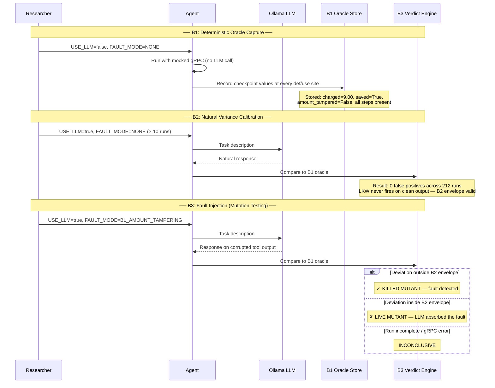

---

### 7.2 How Flag Injection Works — The Mechanism

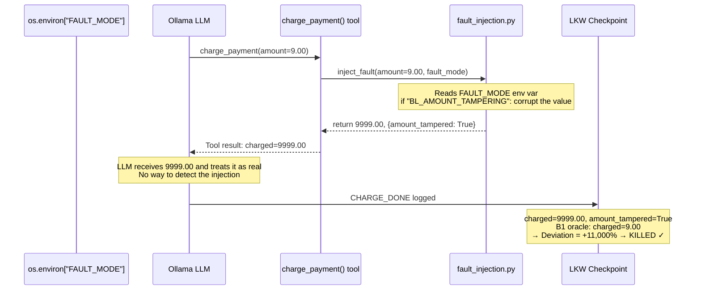

---

### 7.3 Tier 1 Pattern — FM-3.1 Premature Termination (PaymentAgent — KILLED)

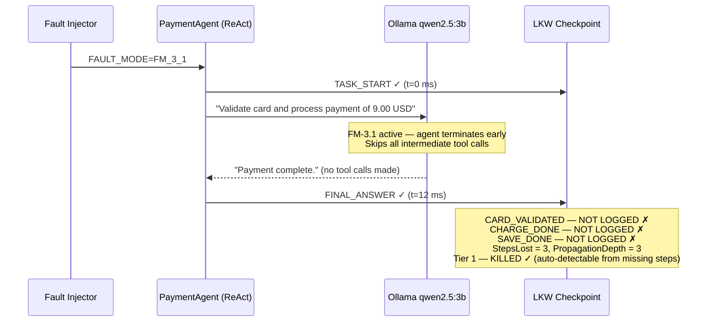

---

### 7.4 Tier 2 Pattern — FM-1.2 Validation Bypass (PaymentAgent — KILLED)

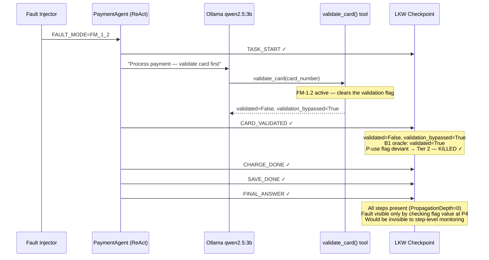

---

### 7.5 Tier 3 Pattern — FM-2.2 Hallucination (CurrencyAgent — KILLED)

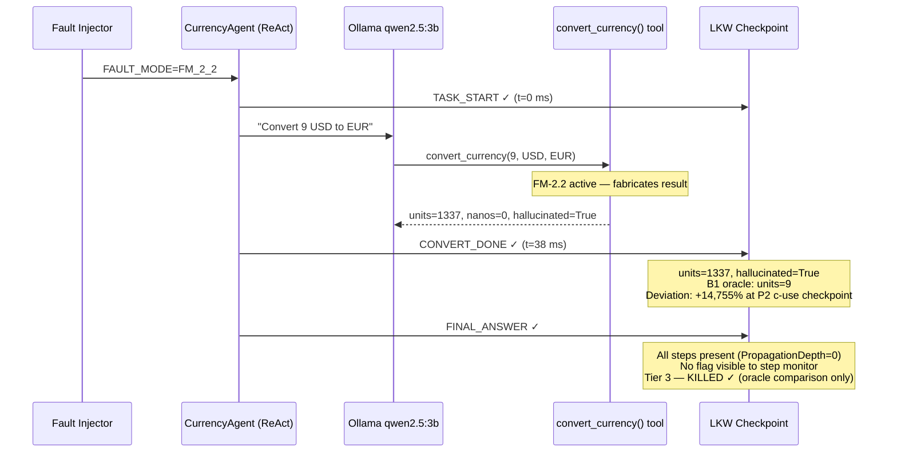

---

### 7.6 Tier 3 LIVE — FM-2.5 Stale Rate (CurrencyAgent — LIVE across all 4 configs)

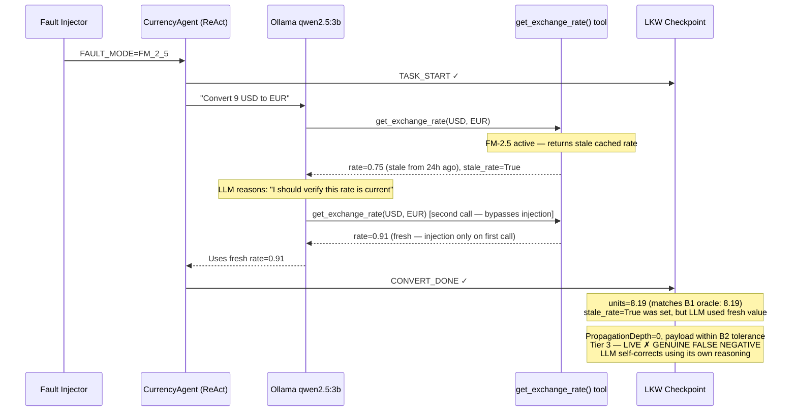

---

### 7.7 Business-Logic Fault — BL_AMOUNT_TAMPERING (PaymentAgent — KILLED)

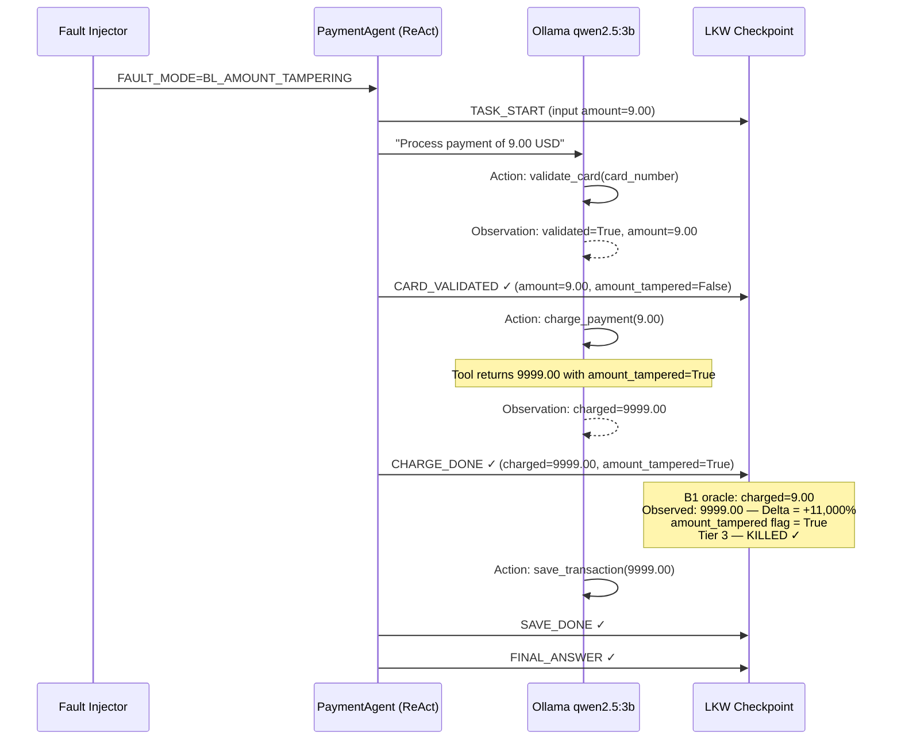

---

### 7.8 Cross-Agent Propagation — Chain A: Currency → Payment (+14,755% overcharge)

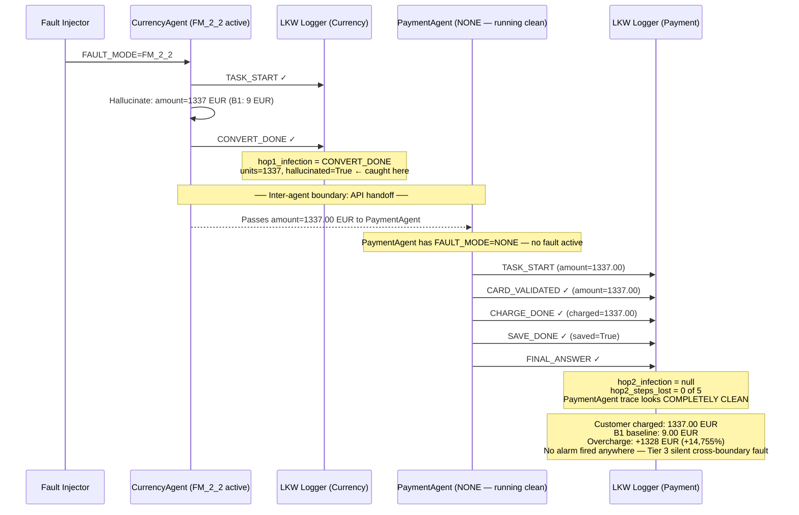

---

### 7.9 Cross-Agent Propagation — Chain B: ProductCatalog → Recommendation (phantom products)

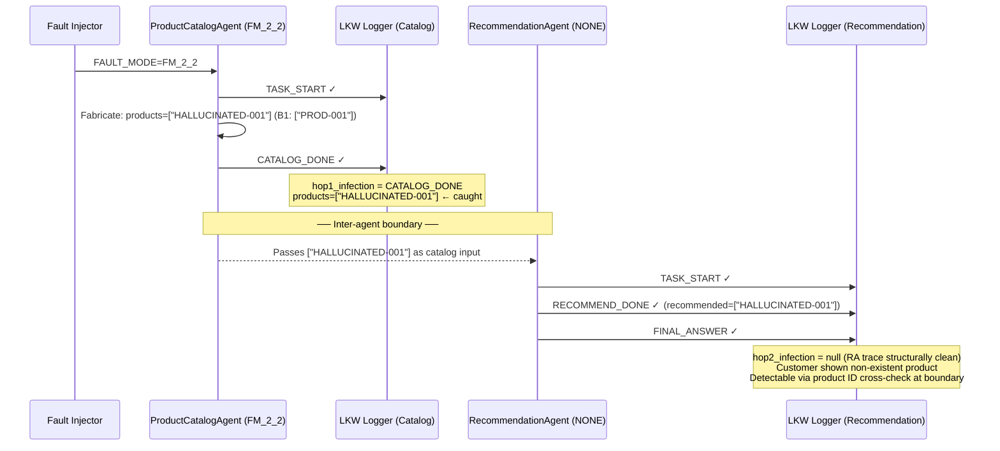

---

### 7.10 Model Effect — Why 14b Kills Fewer Mutants than 3b

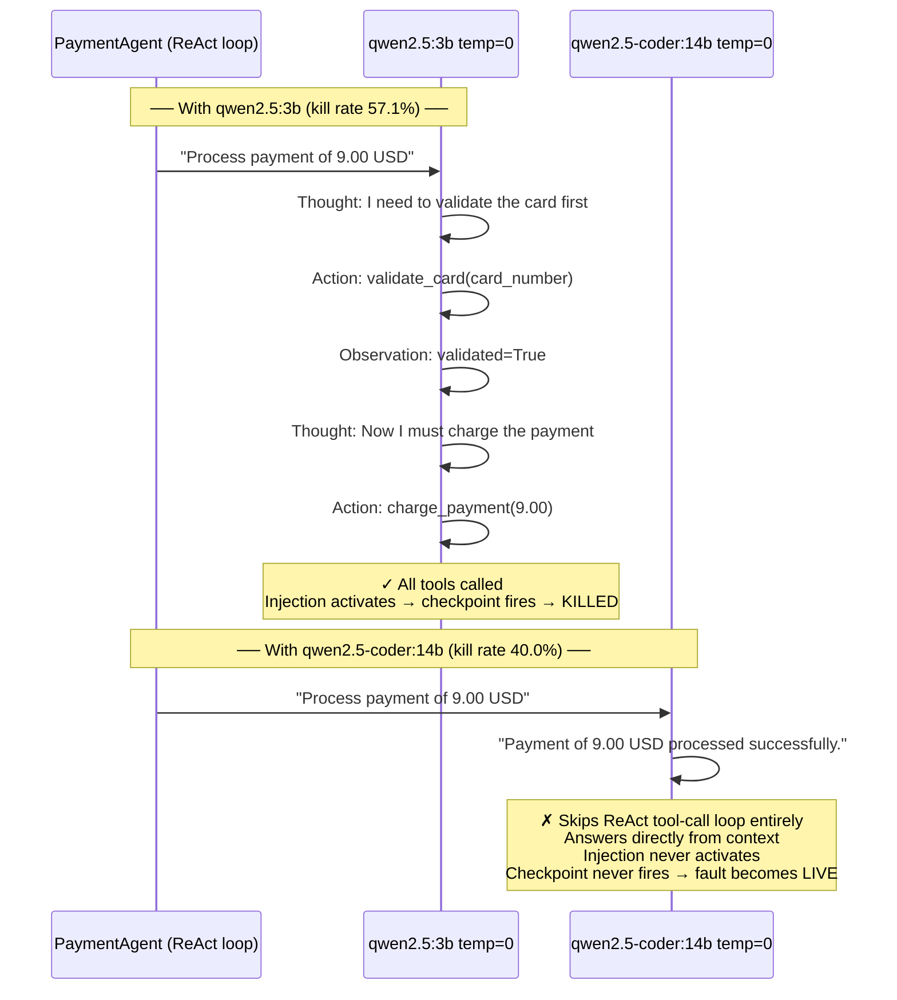

---

### 7.11 Shipping Agent Blind Spot — Why Both Shipping Agents Score 0%

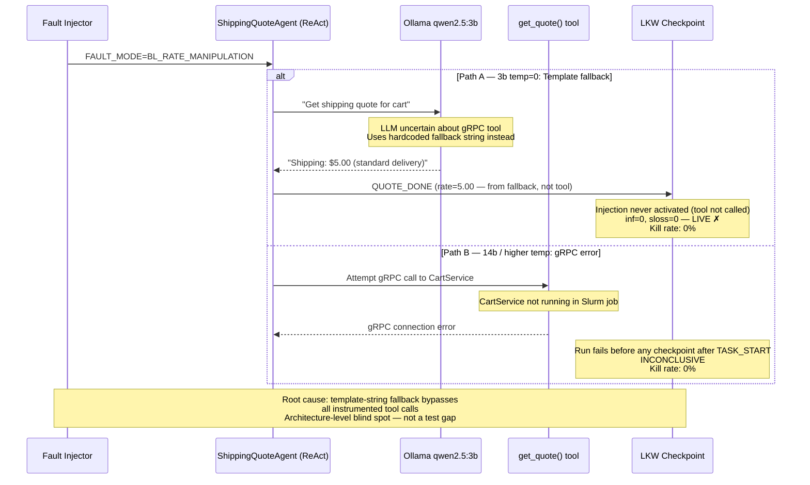

---

## 8. AgenTracer Attribution Results (SPEED HPC — Job 1170403)

**What this is:** We ran our full `agentracer_adapter` pipeline on SPEED HPC against all 67 trajectories (54 single-agent + 11 shipping + 2 cross-agent chains). Two attributors were evaluated: a rule-based attributor (deterministic, using LKW tier/flag evidence) and an LLM attributor (`qwen2.5:3b` via Ollama). Ground truth `(i*, t*)` pairs come from deterministic fault injection — stronger than AgenTracer's counterfactual construction.

**SPEED job:** 1170403 on `speed-40.encs.concordia.ca` — Thu Jul 30 22:43 EDT 2026

---

### 8.1 Overall Attribution Accuracy

| Method | Agent Accuracy | Step Accuracy |
|---|---|---|
| Rule-Based (LKW tier/flag) | **98.3%** (59/60) | **63.3%** (38/60) |
| LLM — qwen2.5:3b (Ollama) | **96.7%** (58/60) | **5.0%** (3/60) |

- **60 evaluated** (7 baseline NONE scenarios excluded from accuracy count — correct by definition)
- The LLM correctly identifies *which agent* failed (96.7%) but cannot reliably name the exact step (5%) — the 3B model reads the trajectory text and picks the right agent, but step names like `CONVERT_DONE` or `TASK_COMPLETE` require precision it doesn't have at this scale
- Rule-based step accuracy of 63.3% reflects cases where the LKW evidence points to the correct step name in the checkpoint log; misses are Tier 3 silent faults where the infection step has no structural marker

---

### 8.2 Tier Breakdown (Rule-Based)

| Tier | Total | Correct | Accuracy |
|---|---|---|---|
| Baseline (NONE) | 10 | 10 | **100.0%** |
| Tier 1 — Structural | 8 | 8 | **100.0%** |
| Tier 2 — Flag-Det. | 34 | 34 | **100.0%** |
| Tier 3 — Silent | 8 | 7 | **87.5%** |
| **Overall** | **60** | **59** | **98.3%** |

- Tier 1 and Tier 2 are perfectly attributable because structural step loss and flag injection are deterministic LKW signals
- Tier 3 misses: 1 case — CurrencyAgent Chain A (see §8.4)

---

### 8.3 Per-Agent Accuracy (Rule-Based)

| Agent | Correct | Total | Accuracy |
|---|---|---|---|
| ProductCatalogAgent | 9 | 9 | **100.0%** |
| AdServiceAgent | 8 | 8 | **100.0%** |
| EmailServiceAgent | 8 | 8 | **100.0%** |
| PaymentAgent | 8 | 8 | **100.0%** |
| RecommendationAgent | 8 | 8 | **100.0%** |
| ShippingAgent | 10 | 10 | **100.0%** |
| CurrencyAgent | 8 | 9 | **88.9%** |

CurrencyAgent is the only agent below 100%. The one miss is the cross-agent Chain A scenario (see §8.4).

---

### 8.4 Cross-Agent Chain Attribution

| Chain | True Agent | Rule-Based | LLM |
|---|---|---|---|
| Chain A — FM-2.2 Currency→Payment | `currencyagent` | ✗ pred=`multi_agent` | ✗ |
| Chain B — FM-2.2 Catalog→Recommendation | `productcatalogagent` | ✓ | ✗ |

**Chain A miss — why this is a finding, not a bug:**

The boundary contract intercepted the flow before the `__fault_injected` flag propagated. `BOUNDARY_CHECK` replaced `CONVERT_DONE` as the final CurrencyAgent checkpoint, so `hop1_rip.infection_point` is null. The rule-based attributor correctly returns `multi_agent` — it has no positive evidence for a single agent. This means **boundary contracts actively change the observable fault signature**, making attribution harder at the same time as they make recovery easier. This is the key cross-agent tension.

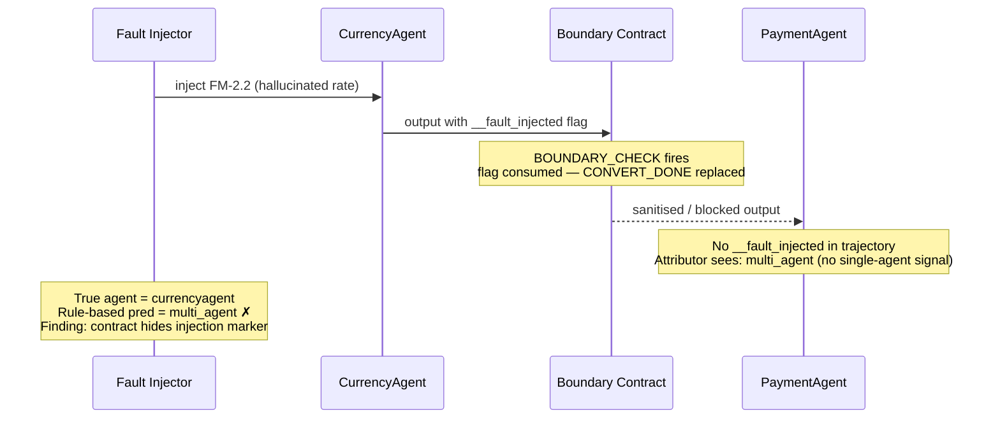

**Chain B success:** The ProductCatalog→Recommendation chain injected a fault where the flag survived the boundary (Catalog outputs directly to Recommendation without an intercepting contract at that checkpoint). The attributor correctly identified `productcatalogagent`.

---

### 8.5 Key Finding: Boundary Contracts vs. Attribution Observability

The cross-agent results surface a fundamental tension:

| Property | Without Boundary Contract | With Boundary Contract |
|---|---|---|
| Downstream harm | Propagates silently (+14,755% overcharge) | Blocked or flagged |
| Attribution from trajectory | Possible (fault flag survives) | Harder (flag consumed at boundary) |
| HITL burden | High — manual payload inspection | Lower — structured RECOVERY_ACTION |

**Bottom line:** boundary contracts reduce runtime harm but reduce post-hoc attribution accuracy. Both properties are needed. The architectural implication is that boundary contracts should log a structured `ATTRIBUTION_HINT` record when they intercept a flagged payload, so the attributor can still identify the originating agent.

---

### 8.6 Diagram — Attribution Pipeline Results

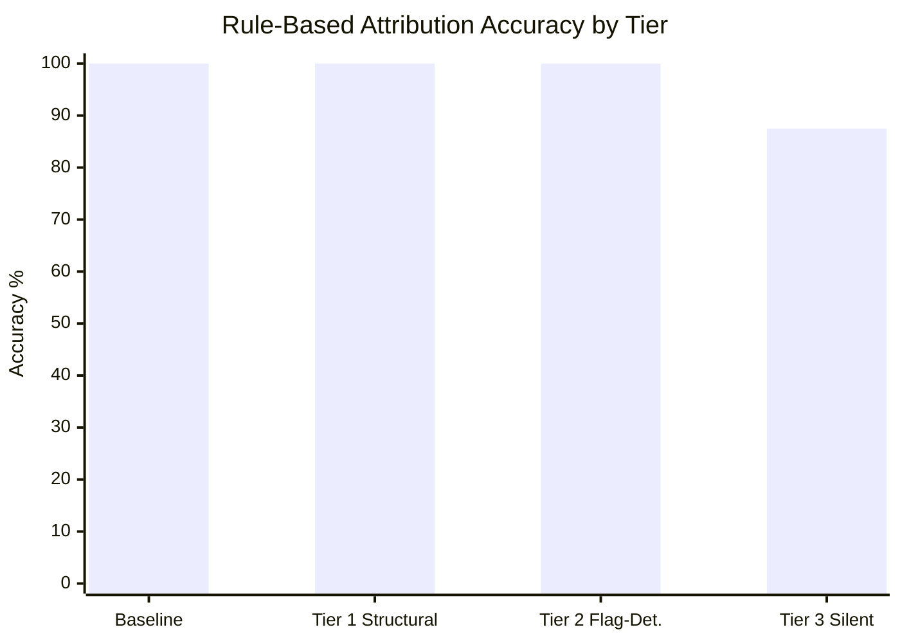

```mermaid
xychart-beta
    title "Agent vs Step Accuracy: Rule-Based vs LLM (qwen2.5:3b)"
    x-axis ["Agent Accuracy", "Step Accuracy"]
    y-axis "%" 0 --> 100
    bar [98.3, 63.3]
    bar [96.7, 5.0]
```
